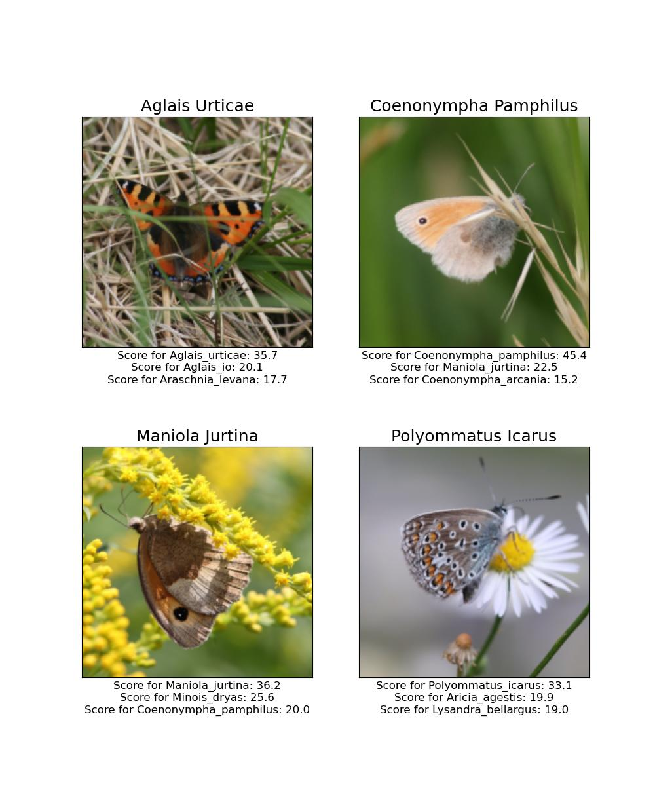

# Butterfly Identification with Neural Networks

This repository contains scripts for training various neural networks on an
image dataset of Austrian butterfly and moth species.

The scripts were used for running model trainings on the
EuroHPC supercomputers [LEONARDO](https://leonardo-supercomputer.cineca.eu/),
hosted by CINECA (Italy) and the LEONARDO consortium, and
[LUMI](https://www.lumi-supercomputer.eu/), hosted by CSC (Finland) and the
LUMI consortium. Both the [LEONARDO Booster
partition](https://wiki.u-gov.it/confluence/display/SCAIUS/Booster+Section) and
LUMI were accessed through [EuroHPC Development Access
calls](https://eurohpc-ju.europa.eu/access-our-supercomputers/access-policy-and-faq_en).

Further, scripts are provided for the national Austrian supercomputer
[MUSICA](https://asc.ac.at/systems/musica/), which was in the closed
test phase at the time of writing; and the
[LEO5](https://www.uibk.ac.at/zid/systeme/hpc-systeme/leo5/) HPC system of the
University of Innsbruck.

Note that the scripts – designed for usage on SLURM clusters – make use of
environment variables like `SLURM_GPUS_PER_TASK` and `OMP_NUM_THREADS`.

Note also that the HPC systems are regularly updated and some configurations
change with time; hence, the used software modules or containers might get
replaced and the settings for requesting appropriate resources with SLURM might
also change.

## Table of Contents

- [Overview](#butterfly-identification-with-neural-networks)
- [Requirements](#requirements)
- [Dataset](#dataset)
- [Usage on LEONARDO](#usage-on-leonardo)
- [Usage on LUMI](#usage-on-lumi)
- [Usage on other (HPC) Systems](#usage-on-other-hpc-systems)
- [Evaluation](#evaluation)
- [Contributors](#contributors)

## Requirements
mention challenges with DDP

Distributed data parallel training is conducted with the help of Huggingface's
[Accelerate](https://huggingface.co/docs/accelerate/en/index) framework.
Furthermore, hyperparameter optimization can be carried out with the [Ray
Tune](https://docs.ray.io/en/latest/tune/index.html) framework.
For the required software packages, see the [`requirements`](preparation/bfly_env.txt) file.

## Dataset

The dataset consists of over 500,000 images of butterflies and moths that were
collected by citizen scientists with the application ["Schmetterlinge
Österreichs"](https://schmetterlingsapp.at/) of the foundation ["Blühendes
Österreich"](https://www.bluehendesoesterreich.at/).

The dataset got published in [Nature Scientific
Data](https://doi.org/10.1038/s41597-025-05708-z) and is accessible on
[figshare](https://figshare.com/s/e79493adf7d26352f0c7).

## Usage on LEONARDO

### Preparation

LEONARDO comes with the
[`CINECA-AI`](https://gitlab.hpc.cineca.it/cineca-ai/cineca-ai) modules, which
contain most of the required software to run the training scripts.
To make use of models that are available through [HuggingFace
`timm`](https://huggingface.co/docs/timm/index), a virtual environment can be
installed with the
[`install_env_leonardo.sh`](preparation/install_env_leonardo.sh) script. If
these models are not intended to be used, the CINECA-AI module is sufficient;
only comment the `import timm` line in the
[`run_acc.py`](training/run_acc.py) script. Also for hyperparameter
optimization, the virtual environment can be installed.

Put the "Schmetterlinge" dataset in a good location on LEONARDO.
The mother directory is to be specified as `DATA_DIR` variable in the
[`leonardo.slurm`](training/leonardo.slurm) SLURM script.

The [`preparation`](preparation) folder should be copied next to the
"Schmetterlinge" dataset.

1. The [`load_models_leonardo.sh`](preparation/load_models_leonardo.sh)
   bash script has to be executed on a login node with access to the internet.
   It stores a list of models from the PyTorch Hub in the PyTorch cache
   directory (and optionally timm models from the Huggingface Hub). This is
   necessary, as compute nodes on LEONARDO do not have access to the internet.
   It makes sense to symlink the `$HOME/.cache` directory from the `$WORK`
   directory in order to save space in `$HOME`. Or, to set the `PYTORCH_HOME`
   environment variable to somewhere in $WORK. Similarly, the `HF_HOME`
   variable can be used for Huggingface timm.

2. The [`prepare_leonardo.slurm`](preparation/prepare_leonardo.slurm)
   SLURM script executes three Python scripts for preparation.
  - The [`create_symlinks.py`](preparation/create_symlinks.py) Python
    script creates the directory `Schmetterlinge_sym` with symbolic links to
    only those classes of butterflies with enough available data to train on.
    This is the part of the dataset which is actually used for training.
  - The [`train_val-test-split.py`](preparation/train_val-test-split.py) Python
    script splits the full dataset into 90% validation plus training data and
    10% for final testing. The resulting
    [`train_val_idx.npy`](preparation/train_val_idx.npy) file contains the
    indices of the set to be used for training and on-the-fly validation, and
    [`test_idx.npy`](preparation/test_idx_npy) the set for final testing. These
    files are stored in the `preparation` folder next to the "Schmetterlinge"
    dataset. Alternatively, the ones already provided in the repo can be used –
    these have been attained with a random seed of 42.
  - The [`oversample.py`](preparation/oversample.py) Python script
    executes a sampler that oversamples minority classes to obtain a more
    balanced dataset during training. Due to the vastness of the dataset, this
    process takes a couple of hours. The created indices are saved and can be
    loaded for the training by specifying `OVERSAMPLING=1` in the main [run
    script](training/leonardo_run_acc.sh). This is an alternative to using class
    weights.  
    Alternatively, the file
    [`oversampled_idx.pth`](preparation/oversampled_idx.pth)
    already contains indices with oversampled minority classes. If located in
    the `preparation` folder next to the "Schmetterlinge" dataset, these indices
    will be loaded automatically if `OVERSAMPLING=1`.

### Execution (Training)

Compute resources are, as usual, determined in the
[`leonardo.slurm`](training/leonardo.slurm) SLURM script. Set the `TASK`
variable to "train".

The SLURM script has to be adapted to the personal credentials and
directories.

Training parameters can be specified in the
[`leonardo_run_acc.sh`](training/leonardo_run_acc.sh) bash script, which is
executed by the SLURM script.

Results and checkpoints are written to the personal `$WORK/$USER` directory
(which should have been created before) and some performance metrics are also
printed to stdout which are redirected to the SLURM output file, if specified.

Loading a checkpoint in order to continue training from it can be done by
passing the checkpoint directory as command line argument to
[`run_acc.py`](training/run_acc.py) in the
[`leonardo_run_acc.sh`](training/leonardo_run_acc.sh) bash script.
Similarly, an own pretrained model (not from the hub) can be further trained by
passing the path to the model as command line argument.

Note that the training and validation sets are created in the training script;
hence, in order to use the same sets for continued training, the same random
seed has to be set. The split can also be created once for every future use in
the [`run_acc.py`](training/run_acc.py) script by uncommenting the
corresponding lines and loading the indices instead of creating them again. The
[`preparation`](preparation) folder contains files with indices of training
([`train_idx.npy`](preparation/train_idx.npy)) and validation
([`val_idx.npy`](preparation/val_idx.npy)) examples attained with a random seed
of 42.

mention challenges with DDP
### Hyperparameter Optimization

Set `TASK="tune"` in the SLURM script to spawn a Ray cluster over all requested
nodes and execute [`leonardo_run_ray.sh`](training/leonardo_run_ray.sh).
Some settings can be chosen therein, others in the Ray configuration section of
the [`run_ray.py`](training/run_ray.py) Python script.

The setup is such that one training configuration will be run per one GPU.

To continue tuning where a previous training ended, the same training and
validation data sets have to be used. Therefore, either the same random seed
has to be set or previously saved indices loaded. Per default, the indices
saved in the `preparation` directory (which is placed next to the
"Schmetterlinge" dataset folder) are loaded.
In this repo, these are created
with a random seed of 42; replace them with your own indices if necessary.
Furthermore, the number of examples per class are stored in
[`targets.npy`](preparation/targets.npy) and are loaded per default, instead of
being calculated (again).

## Usage on LUMI

### Preparation

On LUMI, Singularity containers are provided with most of the required software
to execute the training scripts.

To make use of models that are available through [HuggingFace
`timm`](https://huggingface.co/docs/timm/index),
`timm` has to be installed into the container, which can be done by
uncommenting the corresponding line at the top of the
[`lumi_run_acc.sh`](training/lumi_run_acc.sh) script.
If only models from the PyTorch Hub will be used anyways, the line `import
timm` can be commented in the Python script.

To perform the HPO with Ray, the additional package `hyperopt` needs to be
installed to the container, which can be done by uncommenting the corresponding
line in [`lumi_run_ray.sh`](training/lumi_run_ray.sh) for the first run.

Put the "Schmetterlinge" dataset somewhere onto the fast `flash` directory of
the project on LUMI.
The mother directory is to be specified as `DATA_DIR` variable in the
[`lumi_run_container.sh`](training/lumi_run_container.sh) and
[`lumi_run_ray.sh`](training/lumi_run_ray.sh) scripts.

The [`preparation`](preparation) folder should be copied next to the
"Schmetterlinge" dataset.

The [`prepare_lumi.slurm`](preparation/prepare_lumi.slurm) SLURM script
executes three Python scripts for preparation.
  - The [`create_symlinks.py`](preparation/create_symlinks.py) Python
    script creates the directory `Schmetterlinge_sym` with symbolic links to
    only those classes of butterflies with enough available data to train on.
    This is the part of the dataset which is actually used for training.
  - The [`train_val-test-split.py`](preparation/train_val-test-split.py) Python
    script splits the full dataset into 90% validation plus training data and
    10% for final testing. The resulting
    [`train_val_idx.npy`](preparation/train_val_idx.npy) file contains the
    indices of the set to be used for training and on-the-fly validation, and
    [`test_idx.npy`](preparation/test_idx_npy) the set for final testing. These
    files are stored in the `preparation` folder next to the "Schmetterlinge"
    dataset. Alternatively, the ones already provided in the repo can be used –
    these have been attained with a random seed of 42.
  - The [`oversample.py`](preparation/oversample.py) Python script
    executes a sampler that oversamples minority classes to obtain a more
    balanced dataset during training. Due to the vastness of the dataset, this
    process takes a couple of hours. The created indices are saved and can be
    loaded for the training by specifying `OVERSAMPLING=1` in the main [run
    script](training/lumi_run_acc.sh). This is an alternative to using class
    weights.  Alternatively, the file
    [`oversampled_idx.pth`](preparation/oversampled_idx.pth)
    already contains indices with oversampled minority classes. If located in
    the `preparation` folder next to the "Schmetterlinge" dataset, these indices
    will be loaded automatically if `OVERSAMPLING=1`.

It makes sense to symlink the `$HOME/.cache` directory from the project's
directory in `/scratch` in order to save space in `$HOME`.
Or, to set the `PYTORCH_HOME` environment variable to somewhere in $WORK (and
also the `HF_HOME` variable for Huggingface timm).

### Execution (Training)

Note that the MI250X GPUs on LUMI consist of two compute dies that are used as
two logical GPUs each, see the [LUMI-G
documentation](https://docs.lumi-supercomputer.eu/hardware/lumig/).

Compute resources are, as usual, determined in the
[`lumi.slurm`](training/lumi.slurm) SLURM script. Set the `TASK` variable to
"train".

It starts the [`lumi_run_container.sh`](training/lumi_run_container.sh) script,
which in turn executes the [`lumi_run_acc.sh`](training/lumi_run_acc.sh)
script in the container.
The SLURM script has to be adapted to the personal credentials and directories.

Results and checkpoints are written to the directory specified as `RESULTS_DIR`
and some performance metrics are also printed to stdout which can be redirected
to the SLURM output file.

Training parameters can be specified in the
[`lumi_run_acc.sh`](training/lumi_run_acc.sh) bash script.

Loading a checkpoint in order to continue training from it can be done by
passing the checkpoint directory as command line argument to
[`run_acc.py`](training/run_acc.py) in the
[`lumi_run_acc.sh`](training/lumi_run_acc.sh) bash script.
Similarly, an own pretrained model (not from the hub) can be further trained by
passing the path to the model as command line argument.

Note that the training and validation sets are created in the training script;
hence, in order to use the same sets for continued training, the same random
seed has to be set. The split can also be created once for every future use in
the [`run_acc.py`](training/run_acc.py) script by uncommenting the
corresponding lines and loading the indices instead of creating them again. The
[`preparation`](preparation) folder contains files with indices of training
([`train_idx.npy`](preparation/train_idx.npy)) and validation
([`val_idx.npy`](preparation/val_idx.npy)) examples attained with a random seed
of 42.

### Hyperparameter Optimization

Set `TASK="tune"` in the SLURM script to execute
[`lumi_run_ray.sh`](training/lumi_run_ray.sh).
Some settings can be chosen therein, others in the Ray configuration section of
the [`run_ray.py`](training/run_ray.py) Python script.

The setup is such that one training configuration will be run per one GPU, so
on one LUMI node eight configurations will be tested concurrently.

To continue tuning where a previous training ended, the same training and
validation data sets have to be used. Therefore, either the same random seed
has to be set or previously saved indices loaded. Per default, the indices
saved in the `preparation` directory (which is placed next to the
"Schmetterlinge" dataset folder) are loaded.
In this repo, these are created
with a random seed of 42; replace them with your own indices if necessary.
Furthermore, the number of examples per class are stored in
[`targets.npy`](preparation/targets.npy) and are loaded per default, instead of
being calculated (again).

## Usage on other (HPC) Systems

Similar steps have to be performed on other HPC systems.

Not only on LEONARDO does it make sense to download (some) models before use,
using the [`load_models.py`](preparation/load_models.py) Python script.
It makes sense to symlink the `$HOME/.cache` directory from a larger filesystem
in order to save space in `$HOME`.
Or, to set the `PYTORCH_HOME` environment variable to somewhere in $WORK (and
also the `HF_HOME` variable for Huggingface timm).

Similarly, if a conda environment is installed, it should be installed in a
large filesystem on the HPC system and not in `$HOME`. Either by a symlink to
`$HOME/.conda`, providing the `envs_dirs` setting in the `.condarc` file or by
specifying the `--prefix` at installation.

If the necessary software packages do not come preinstalled as modules, in
containers or similar, a virtual environment can be installed. The repository
contains an example of a sufficient [pip requirements
file](preparation/bfly_env.txt) and a [conda environment
file](preparation/bfly_env.yaml).
To install with GPU-support, a CUDA module often has to be loaded.

Example files for Austria's national
[MUSICA](https://asc.ac.at/systems/musica/) supercomputer and the
[LEO5](https://www.uibk.ac.at/zid/systeme/hpc-systeme/leo5/) HPC system of the
University of Innsbruck. are also provided in this repository.

## Evaluation

Use the test data indices either created at the preparation step or the ones
given in [`test_idx.npy`](preparation/test_idx.npy) (mind the random seed).

A basic example script for evaluation on the test dataset is given by
[`model_test.py`](testing/model_test.py). It loads the test data indices from
the `preparation` folder next to the "Schmetterlinge" dataset. The script then
saves the model predictions and the true labels as a dictionary.
Additionally, the softmax functions of the model outputs are saved.

This script is not designed for multi-GPU runs and expects the number of CPUs
for the `DataLoader` as command line argument.

A trained MaxViT model is available on
[HuggingFace](https://huggingface.co/RikeB/MaxViT_butterfly_identification).

## Contributors

The project was supported by the [Viel
Falter](https://viel-falter.at/projektpartner/universitaet-innsbruck/) butterfly 
monitoring project and [EuroCC Austria](https://eurocc-austria.at/).

Friederike Barkmann developed the first version of the scripts for model 
training and testing. Andreas Lindner contributed to the
scripts, adapting the code for high performance computing and implementing data
parallelism to reduce training times.

For the license, see the [LICENSE](LICENSE) file; and for the publications, see the [CITATION](CITATION) file.
